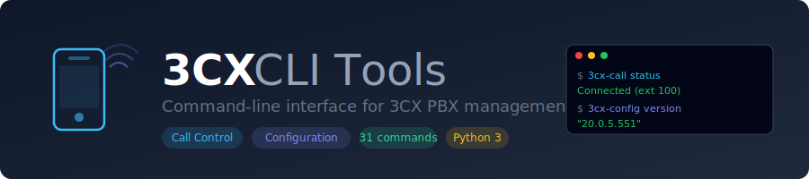
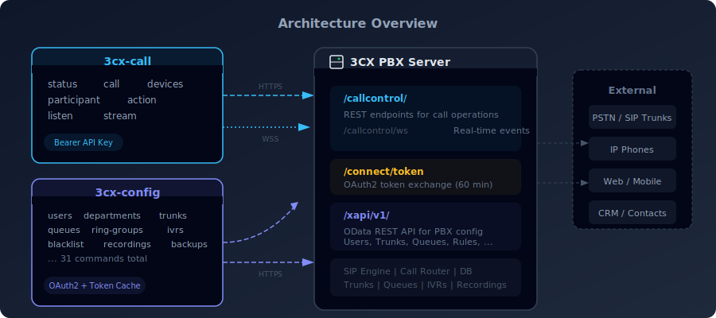
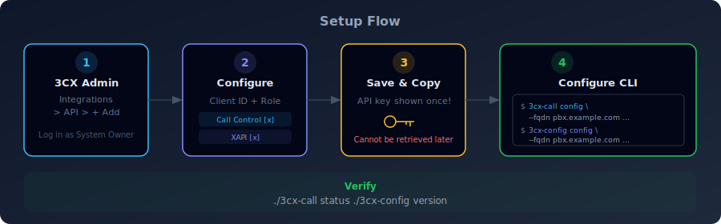
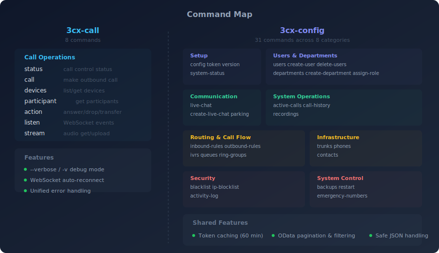

<p align="center">
  
</p>

Two command-line tools for interacting with 3CX PBX APIs:

- **`3cx-call`** - Call Control API (make calls, manage participants, real-time events)
- **`3cx-config`** - Configuration REST API (manage users, departments, system, security, and more)

<p align="center">
  
</p>

## Requirements

- Python 3.8+
- Linux/macOS (or Windows with Python)

## Installation

### Option 1: Direct Install (Debian/Ubuntu)

```bash
# Install Python dependencies
sudo apt update
sudo apt install -y python3 python3-requests python3-websocket

# Clone or download the scripts
git clone <repository-url> 3cx
cd 3cx

# Make executable
chmod +x 3cx-call 3cx-config
```

### Option 2: Using Virtual Environment

```bash
# Create virtual environment
python3 -m venv venv
source venv/bin/activate

# Install dependencies
pip install requests websocket-client

# Make executable
chmod +x 3cx-call 3cx-config
```

### Option 3: System-wide Install (pip)

```bash
pip install --break-system-packages requests websocket-client
chmod +x 3cx-call 3cx-config
```

<p align="center">
  
</p>

## Configuring 3CX PBX for API Access

Both CLI tools require an API integration to be created in the 3CX Admin Console. The same integration can serve both APIs, or you can create separate ones.

**License requirement:** You must have an **8SC+ Enterprise** (ENT/AI or ENT+) license. The API features are not available on smaller or non-Enterprise plans.

### Step 1: Create an API Integration

1. Log into the **3CX Web Client** with a System Owner account.
2. Click **Admin** in the lower-left corner to open the Admin Console.
3. Navigate to **Integrations** → **API**.
4. Click **+ Add** to create a new client application.

### Step 2: Configure the Integration

Fill in the following fields:

| Field | Description |
|-------|-------------|
| **Client ID** | A unique identifier for this integration. This can be a DN/extension number (e.g., `100`), a Route Point name (e.g., `ai`), or any text string (e.g., `my-app`). If using Call Control, this is the DN that will be used for call operations. |
| **Department** | Select `DEFAULT` for system-wide access, or a specific department. |
| **Role** | Select the permission level for this integration (see table below). **Use `System Owner` for full Configuration API access** -- lower roles may lack access to call history, recordings, and other endpoints. |

**API access checkboxes** -- enable one or both depending on which CLI tool you plan to use:

| Checkbox | Required for | Endpoint |
|----------|-------------|----------|
| **3CX Call Control API Access** | `3cx-call` | `/callcontrol/` |
| **XAPI Access Enabled** | `3cx-config` | `/xapi/v1/` |

**Optional Call Control settings** (only relevant for `3cx-call`):

- **DID Numbers**: Associate DID numbers with this Route Point.
- **Extensions to Monitor**: Add extensions whose call events you want to receive via WebSocket. If left blank, you will not receive events for other extensions.

### Step 3: Save and Copy Credentials

Click **Save**. A popup will display the **API key/secret**. **Copy it immediately** -- it is shown only once and cannot be retrieved later.

You now have two values needed for CLI configuration:

| Value | What it is | Used by |
|-------|-----------|---------|
| **Client ID** | The identifier you entered in Step 2 | Both tools (as `--client-id` for config, as the DN for call) |
| **API Key / Secret** | The generated key shown after saving | Both tools (as `--client-secret` for config, as `--api-key` for call) |

### Step 4: Available Roles

| Role | Scope | Notes |
|------|-------|-------|
| `System Owner` | Full access to all endpoints | **Recommended for Configuration API** |
| `System Admin` | System administration | Cannot access some owner-only resources |
| `Group Owner` | Department-level owner | Limited to assigned department |
| `Manager` | Department manager | Limited to assigned department |
| `Group Admin` | Department administrator | Limited to assigned department |
| `Receptionist` | Basic access | Very limited API access |
| `User` | Minimal access | Very limited API access |

> **Important:** If you select `System Wide` as the department, the role is automatically set to `User` and cannot be changed. To get `System Owner` access, select a specific department (e.g., `DEFAULT`).

### Step 5: Verify Network Access

Ensure your client machine can reach the 3CX server on HTTPS (port 443):

```bash
# Test connectivity
curl -s -o /dev/null -w "%{http_code}" https://your-pbx.example.com/xapi/v1/Pbx.GetVersion
# Expected: 401 (unauthorized but reachable)
```

If you get a connection timeout, check firewall rules and DNS resolution. WebSocket connections (`wss://`) also use port 443.

## CLI Setup

### 1. Call Control API (`3cx-call`)

Using the Client ID and API Key from the integration you created above:

```bash
./3cx-call config \
  --fqdn your-pbx.example.com \
  --api-key YOUR_API_KEY \
  --dn 100
```

- `--fqdn`: Your 3CX server hostname (without `https://`).
- `--api-key`: The API key/secret shown when you saved the integration.
- `--dn`: The Client ID (DN/extension) you configured for this integration.

Verify it works:

```bash
./3cx-call status
```

### 2. Configuration API (`3cx-config`)

Using the same Client ID and API Key:

```bash
./3cx-config config \
  --fqdn your-pbx.example.com \
  --client-id YOUR_CLIENT_ID \
  --client-secret YOUR_API_KEY
```

- `--fqdn`: Your 3CX server hostname (without `https://`).
- `--client-id`: The Client ID you entered when creating the integration.
- `--client-secret`: The API key/secret shown when you saved the integration.

Verify it works:

```bash
./3cx-config version
```

**Token caching**: Tokens are automatically cached after the first request and refreshed when needed. The default token lifetime is 60 minutes. You do not need to manually run `./3cx-config token` before each command -- the tool handles authentication transparently.

### Authentication Flow

The two APIs use different authentication mechanisms under the hood:

| | Call Control API (`3cx-call`) | Configuration API (`3cx-config`) |
|---|---|---|
| **Auth method** | Bearer API key (static) | OAuth2 client credentials (token exchange) |
| **Token endpoint** | N/A -- key is sent directly | `POST https://{fqdn}/connect/token` |
| **Token lifetime** | Permanent (until key is revoked) | 60 minutes (auto-refreshed by the CLI) |
| **Header format** | `Authorization: Bearer {api_key}` | `Authorization: Bearer {access_token}` |

## Usage

<p align="center">
  
</p>

### 3cx-call - Call Control

All `3cx-call` commands accept a global `--verbose` / `-v` flag that prints the HTTP method and URL for every request, which is useful for debugging:

```bash
# Verbose mode - shows request details on stderr
./3cx-call -v status
./3cx-call --verbose call --destination 1234567890
```

```bash
# View call status
./3cx-call status
./3cx-call status --dn 101

# List devices
./3cx-call devices
./3cx-call devices --device-id "device-uuid"

# Make a call
./3cx-call call --destination 1234567890
./3cx-call call --destination 1234567890 --timeout 60
./3cx-call call --destination 1234567890 --device-id "device-uuid"

# Get participants
./3cx-call participant
./3cx-call participant --participant-id 1

# Perform actions on participants
./3cx-call action --participant-id 1 --action answer
./3cx-call action --participant-id 1 --action drop
./3cx-call action --participant-id 1 --action divert --destination 200
./3cx-call action --participant-id 1 --action transferto --destination 101
./3cx-call action --participant-id 1 --action routeto --destination 102

# Listen for real-time events (WebSocket)
./3cx-call listen
./3cx-call listen --retries 10

# Stream audio
./3cx-call stream --participant-id 1 --output audio.raw
./3cx-call stream --participant-id 1 --upload response.raw
```

#### WebSocket Reconnection

The `listen` command automatically reconnects when the WebSocket connection drops unexpectedly. Reconnection uses exponential backoff (2s, 4s, 8s, ... up to 60s) and defaults to 5 retry attempts. Use `--retries N` to change the limit:

```bash
# Default: 5 reconnection attempts
./3cx-call listen

# Up to 20 reconnection attempts
./3cx-call listen --retries 20

# No automatic reconnection
./3cx-call listen --retries 0
```

On a successful reconnect, the retry counter resets to zero. Press `Ctrl+C` at any time to stop cleanly (no reconnection on manual exit).

#### Available Actions

| Action | Description | Parameters |
|--------|-------------|------------|
| `answer` | Answer incoming call | None |
| `drop` | End participation | None |
| `divert` | Redirect ringing call | `--destination` |
| `routeto` | Add alternative route | `--destination` |
| `transferto` | Transfer connected call | `--destination` |
| `attach_participant_data` | Attach data to participant | `--attached-data` |
| `attach_party_data` | Attach data to caller | `--attached-data` |

#### Divert Reasons

Use `--reason` with these values:
- `NoAnswer`, `PhoneBusy`, `PhoneNotRegistered`, `ForwardAll`
- `BasedOnCallerID`, `BasedOnDID`
- `OutOfOfficeHours`, `BreakTime`, `Holiday`, `OfficeHours`
- `NoDestinations`, `Polling`, `CallbackRequested`, `Callback`

### 3cx-config - Configuration

#### Complete Command Reference

`3cx-config` provides 31 subcommands organized into functional categories:

| Category | Commands |
|----------|----------|
| **Setup** | `config`, `token`, `version` |
| **Users & Departments** | `users`, `create-user`, `delete-users`, `assign-role`, `departments`, `create-department`, `delete-department` |
| **Communication** | `live-chat`, `create-live-chat`, `parking` |
| **System Operations** | `system-status`, `active-calls`, `call-history`, `recordings` |
| **Routing & Call Flow** | `inbound-rules`, `outbound-rules`, `ivrs`, `queues`, `ring-groups` |
| **Infrastructure** | `trunks`, `phones`, `contacts` |
| **Security** | `blacklist`, `ip-blocklist`, `activity-log` |
| **System Control** | `backups`, `restart`, `emergency-numbers` |

#### Setup & Authentication

```bash
# Get access token (usually not needed -- tokens are auto-cached)
./3cx-config token

# Get 3CX version
./3cx-config version
```

#### Users & Departments

```bash
# Departments
./3cx-config departments
./3cx-config departments --name "Sales"
./3cx-config create-department --name "Support" --prompt-set "uuid" --language EN
./3cx-config delete-department --id 123

# Users
./3cx-config users
./3cx-config users --email user@example.com
./3cx-config users --top 50 --skip 100
./3cx-config create-user \
  --first-name John \
  --last-name Doe \
  --email john@example.com \
  --password "SecurePass123!" \
  --extension 201 \
  --prompt-set "uuid"
./3cx-config delete-users --ids 37 38
./3cx-config assign-role --user-id 120 --group-id 95 --role managers
```

#### Communication

```bash
# Live Chat
./3cx-config live-chat
./3cx-config live-chat --check "mychat123"
./3cx-config create-live-chat \
  --link "support-chat" \
  --group-id 95 \
  --group-name "DEFAULT" \
  --group-number "GRP0000"

# Shared Parking
./3cx-config parking
./3cx-config parking --create --group-ids 95 122
./3cx-config parking --delete 126
```

#### System Operations

```bash
# System status
./3cx-config system-status

# Active calls
./3cx-config active-calls
./3cx-config active-calls --top 10
./3cx-config active-calls --drop 42

# Call history (default: last 7 days)
./3cx-config call-history --top 50
./3cx-config call-history --start "2026-01-01T00:00:00Z" --end "2026-01-31T23:59:59Z"
./3cx-config call-history --filter "StartTime gt 2024-01-01"

# Recordings
./3cx-config recordings
./3cx-config recordings --download 123
./3cx-config recordings --delete 123 456
```

#### Routing & Call Flow

```bash
# Inbound rules
./3cx-config inbound-rules
./3cx-config inbound-rules --id 5
./3cx-config inbound-rules --delete 10 11

# Outbound rules
./3cx-config outbound-rules
./3cx-config outbound-rules --id 5
./3cx-config outbound-rules --delete 10 11

# IVRs (read-only)
./3cx-config ivrs
./3cx-config ivrs --id 3

# Queues (read-only)
./3cx-config queues
./3cx-config queues --id 3

# Ring groups (read-only)
./3cx-config ring-groups
./3cx-config ring-groups --top 20
```

#### Infrastructure

```bash
# Trunks
./3cx-config trunks
./3cx-config trunks --id 1
./3cx-config trunks --delete 5 6

# Phones
./3cx-config phones
./3cx-config phones --id 2
./3cx-config phones --delete 7 8

# Contacts
./3cx-config contacts
./3cx-config contacts --id 42
./3cx-config contacts --export
./3cx-config contacts --delete 10 11
```

#### Security

```bash
# Blacklist (phone numbers)
./3cx-config blacklist
./3cx-config blacklist --add "555-0000"
./3cx-config blacklist --delete 1 2

# IP blocklist
./3cx-config ip-blocklist
./3cx-config ip-blocklist --add "192.168.1.100" --description "Suspicious"
./3cx-config ip-blocklist --delete 5

# Activity log
./3cx-config activity-log
./3cx-config activity-log --start "2026-02-01T00:00:00Z" --end "2026-02-28T23:59:59Z"
./3cx-config activity-log --extension "100"
./3cx-config activity-log --call-id "abc123"
./3cx-config activity-log --severity "Error"
./3cx-config activity-log --purge
```

#### System Control

```bash
# Backups
./3cx-config backups
./3cx-config backups --create
./3cx-config backups --restore "backup_2026-02-27.zip"

# Restart (requires --confirm flag as a safety measure)
./3cx-config restart --confirm

# Emergency numbers
./3cx-config emergency-numbers
./3cx-config emergency-numbers --add "911" --name "Emergency"
./3cx-config emergency-numbers --delete 1
```

### OData Pagination & Filtering

Most list commands in `3cx-config` support OData-style pagination and filtering through three shared flags:

| Flag | Default | Description |
|------|---------|-------------|
| `--top N` | 100 | Maximum number of items to return |
| `--skip N` | 0 | Number of items to skip (for pagination) |
| `--filter EXPR` | *(none)* | OData `$filter` expression |

```bash
# Pagination: get the third page of 50 users
./3cx-config users --top 50 --skip 100

# Filter departments by name
./3cx-config departments --filter "Name eq 'Sales'"

# Filter call history by date
./3cx-config call-history --filter "StartTime gt 2024-01-01" --top 200

# Combine pagination and filtering
./3cx-config contacts --filter "CompanyName eq 'Acme'" --top 25 --skip 50
```

These flags work with: `users`, `departments`, `live-chat`, `parking`, `active-calls`, `call-history`, `recordings`, `inbound-rules`, `outbound-rules`, `ivrs`, `queues`, `ring-groups`, `trunks`, `phones`, `contacts`, `blacklist`, `ip-blocklist`, `activity-log`, `backups`, and `emergency-numbers`.

### API Endpoint Mapping

Some CLI command names differ from their underlying 3CX API endpoint names. This table maps them for developers using the API directly:

| CLI Command | API Endpoint | Notes |
|-------------|-------------|-------|
| `phones` | `SipDevices` | Hardware/softphone devices |
| `ivrs` | `CallFlowApps` | IVR / Auto-attendant menus |
| `emergency-numbers` | `EmergencyGeoLocations` | E911 / emergency routing |
| `call-history` | `ReportCallLogData/Pbx.GetCallLogData(...)` | OData function with date params |
| `activity-log` | `ActivityLog/Pbx.GetLogs(...)` | OData function with filter params |

#### User Roles

| Role | Description |
|------|-------------|
| `system_owners` | Full system access |
| `system_admins` | System administration |
| `group_owners` | Department owner |
| `managers` | Department manager |
| `group_admins` | Department administrator |
| `receptionists` | Receptionist |
| `users` | Standard user |

## Configuration Files

Credentials are stored in your home directory:

- `~/.3cx-call.json` - Call Control API settings
- `~/.3cx-config.json` - Configuration API settings (also stores cached tokens)

File permissions are set to `600` (owner read/write only) for security.

## Audio Streams

Audio streams use **PCM 16-bit 8000Hz mono** format.

### Converting Audio

```bash
# Convert WAV to PCM using ffmpeg
ffmpeg -i input.wav -f s16le -acodec pcm_s16le -ar 8000 -ac 1 output.raw

# Convert PCM to WAV
ffmpeg -f s16le -ar 8000 -ac 1 -i input.raw output.wav
```

## WebSocket Events

When using `./3cx-call listen`, you'll receive these event types:

| EventType | Description |
|-----------|-------------|
| 0 (Upsert) | Entity added or updated |
| 1 (Remove) | Entity removed |
| 2 (DTMF) | DTMF digits received |
| 4 (Response) | Response to request |

## Troubleshooting

### Error 401 Unauthorized

**Call Control API:**
- Verify the API key is correct
- Ensure "3CX Call Control API Access" is enabled in 3CX
- Check that the DN matches the Client ID configured

**Configuration API:**
- Verify `client_id` and `client_secret` are correct
- Tokens are auto-cached and refreshed, but if you see 401 errors persistently, re-run `./3cx-config config` to update your credentials

### Error 403 Forbidden

- Configuration API: Ensure Service Principal is properly configured
- Your API credentials may lack required permissions/roles

### Error 404 Not Found

- Check the FQDN is correct (don't include `https://`)
- Verify the endpoint exists and DN/ID is valid

### WebSocket Connection Issues

- Ensure port 443/HTTPS is accessible
- Check firewall rules for WebSocket connections
- Verify API key has proper Call Control scope
- The `listen` command will automatically reconnect on unexpected disconnects (up to `--retries N` times, default 5)

### Connection Timeout

- Verify PBX FQDN is reachable: `ping your-pbx.example.com`
- Check if behind a proxy that blocks WebSocket
- Use `--verbose` (`-v`) to see the exact URLs being requested

## Useful Tips

### 1. Get Prompt Set UUID

Before creating users/departments, get the Prompt Set UUID:

```bash
# List available prompt sets via API or check 3CX Admin Console
# Under Settings > Prompts > Prompt Sets
```

### 2. Test Connection

```bash
# Quick test for Call Control API
./3cx-call status

# Quick test for Configuration API
./3cx-config version
```

### 3. Batch Operations

For bulk user creation, create a script:

```bash
#!/bin/bash
while IFS=, read -r first last email ext; do
  ./3cx-config create-user \
    --first-name "$first" \
    --last-name "$last" \
    --email "$email" \
    --password "TempPass123!" \
    --extension "$ext" \
    --prompt-set "your-uuid"
done < users.csv
```

### 4. Monitor Multiple Extensions

Configure additional extensions in 3CX Admin Console under:
**Integrations → API → [Your App] → Extensions to Monitor**

### 5. Use with CRM Integration

```bash
# Make call from CRM contact
./3cx-call call --destination "$PHONE" --attached-data '{"crm_id":"12345"}'

# Listen for events and trigger CRM updates
./3cx-call listen | grep -q "UPSERT" && ./update-crm.sh
```

### 6. Schedule Reports

```bash
# Daily user report (cron)
0 9 * * * /home/user/3cx/3cx-config users > /var/log/3cx-users-$(date +\%Y\%m\%d).json
```

### 7. Find Group ID

```bash
# Get group ID by name
./3cx-config departments --name "Sales" | jq '.value[0].Id'
```

### 8. Validate Live Chat URL

```bash
# Check if URL is available before creating
./3cx-config live-chat --check "my-chat-url"
```

### 9. Debug API Requests

```bash
# Use verbose mode to see exactly what is being sent
./3cx-call -v status
./3cx-call -v call --destination 200
```

### 10. Long-Running Event Listener

```bash
# Run listener with generous retry budget for production use
./3cx-call listen --retries 100
```

## API Reference

- [3CX Call Control API Documentation](https://www.3cx.com/docs/call-control-api/)
- [3CX Call Control API Endpoints](https://www.3cx.com/docs/call-control-api-endpoints/)
- [3CX Configuration API](https://www.3cx.com/docs/configuration-rest-api/)
- [3CX Configuration API Endpoints](https://www.3cx.com/docs/configuration-rest-api-endpoints/)

## License

MIT License - Use at your own risk.

## Support

For 3CX API issues, consult:
- [3CX Community Forums](https://www.3cx.com/community/)
- [3CX Documentation](https://www.3cx.com/docs/)
- [GitHub Call Control Examples](https://github.com/3cx/call-control-examples)
